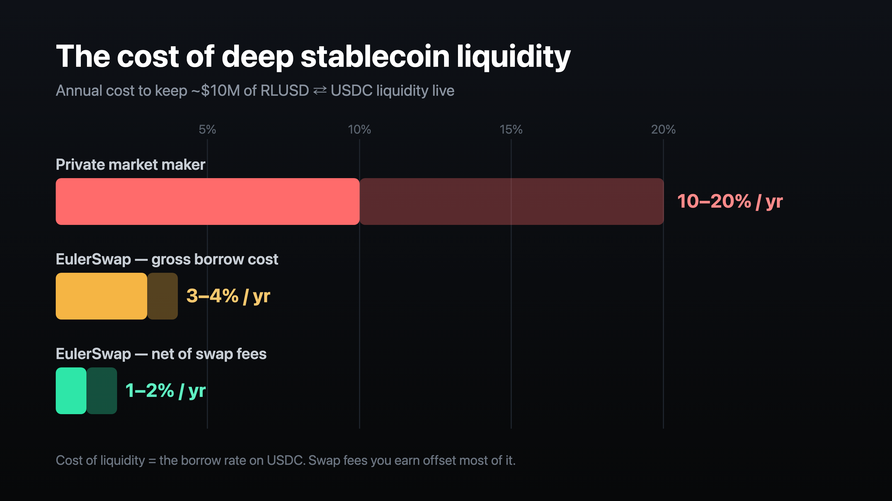
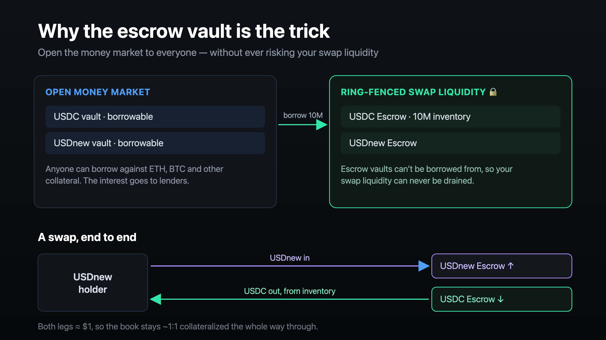
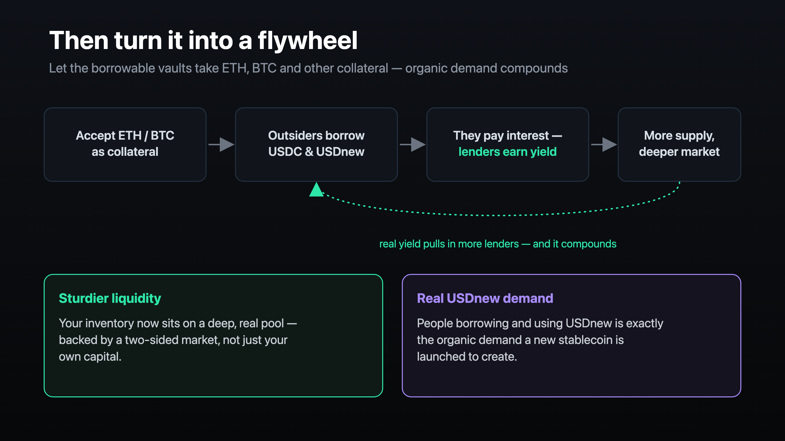
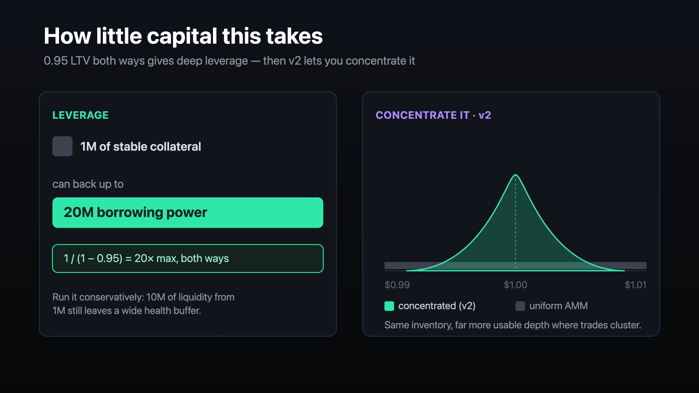

# Bootstrapping stablecoin liquidity with EulerSwap

A worked, deployable example of bootstrapping deep stablecoin liquidity **without a
market maker** — by manufacturing exit liquidity out of an Euler lending market.

The script in [`script/DeployBootstrapMarket.s.sol`](script/DeployBootstrapMarket.s.sol)
deploys a complete, **ungoverned** (immutable) USDC/USDT market on Ethereum mainnet:
borrowable vaults, collateral-only escrow vaults, a price router, an EulerSwap pool,
and the seed LP position — in one run, validated against a mainnet fork.

> ⚠️ **Experimental, unaudited reference code.** Verify every address and parameter,
> fork-test, and get a review before risking real funds. See [Risks](#risks).

---

## The idea

Every team launching a new stablecoin hits the same wall: you need deep, reliable
liquidity so people can get in and out of your token — and a private market maker
will quote you **10–20% a year**, plus inventory risk, plus custody of your float.

There's a much cheaper way, and it falls straight out of how EulerSwap works.



**Liquidity is just borrowed inventory.** When someone holding your stablecoin wants
out, what they need is USDC on the other side. The cheapest USDC inventory in the
world is *borrowed* USDC: if your stable is solid collateral, borrowing USDC against
it costs ~3–4% a year. That borrow rate is your cost of liquidity — and swap fees you
earn offset most of it, often down to ~1–2% net.

### The escrow trick



The swap inventory lives in **collateral-only escrow vaults**. Nothing can be borrowed
*out* of an escrow vault, so your swap liquidity can never be drained by the money
market — even while you open the borrowable vaults to other users.

### Make it a real money market



The borrowable vaults accept **cbBTC and WETH** as collateral too, so outsiders can
borrow your stables against their crypto. That organic borrow demand pays interest to
lenders (deepening the pool you borrow from) and — when the second leg is a new stable
— creates genuine demand for it.

### Capital efficiency



At 0.95 LTV both ways the loop is generous (~20× from stable collateral), and EulerSwap
v2 lets you concentrate the curve inside a tight band around $1 for maximum depth where
trades actually cluster.

---

## What the script deploys

```
                         EulerRouter (Chainlink adapters, governance renounced)
                          │
   ┌──────────────────────┴───────────────────────────────────────────┐
   │  BORROWABLE (controllers, ungoverned)   COLLATERAL-ONLY (escrow)  │
   │  ┌────────────┐  ┌────────────┐          ┌──────────┐ ┌──────────┐ │
   │  │ eUSDC      │  │ eUSDT      │          │ USDC esc │ │ USDT esc │ │  ← swap inventory
   │  └────────────┘  └────────────┘          └──────────┘ └──────────┘ │
   │        ▲ accepts as collateral ─────────▶┌──────────┐ ┌──────────┐ │
   │                                          │ cbBTC esc│ │ WETH esc │ │  ← organic demand
   │                                          └──────────┘ └──────────┘ │
   └───────────────────────────────────────────────────────────────────┘
                          │
              EulerSwap pool (USDC/USDT)
              supply = escrows (inventory) · borrow = borrowable vaults (debt)
```

In one `deployMarket(...)` call:

1. **Four ChainlinkOracle adapters** (USDC, USDT, cbBTC, WETH → USD).
2. **A reactive adaptive-curve IRM** for the borrowable stable vaults — it self-tunes
   the rate toward target utilization, which is the right choice for an immutable
   market that can never be retuned.
3. **An Edge market** via the canonical `EdgeFactory`: borrowable eUSDC/eUSDT,
   collateral-only escrow vaults for USDC/USDT/cbBTC/WETH, a fresh `EulerRouter`,
   LTVs between them — then **all governance renounced** (vaults + router immutable).
4. **The seed LP equity** deposited into the stable escrow vaults.
5. **A USDC/USDT EulerSwap pool** whose inventory sits in the escrows (ring-fenced)
   and which borrows from the borrowable vaults. The pool address is **salt-mined**
   so it carries valid Uniswap V4 hook flags, and it's installed as an EVC operator
   before deployment.

All Euler infrastructure addresses, token addresses, Chainlink feeds, LTVs, IRM and
curve parameters live in clearly-labelled constants at the top of the script.

---

## Run it

```bash
forge install                       # forge-std + euler-price-oracle
cp .env.example .env                # set MAINNET_RPC_URL (+ PRIVATE_KEY to broadcast)

# 1. Validate end-to-end against a mainnet fork (deploys everything, asserts a quote):
MAINNET_RPC_URL=https://... forge test --match-path "test/*.fork.t.sol" -vvv

# 2. Broadcast for real (the deployer must already hold SEED_USDC + SEED_USDT):
forge script script/DeployBootstrapMarket.s.sol:DeployBootstrapMarket \
  --rpc-url mainnet --broadcast --slow -vvvv
```

The fork test deploys the full market and asserts the vaults are ungoverned, the LTVs
are wired, the inventory is in escrow, the operator is installed, and the pool quotes
~1:1 minus the swap fee.

---

## Slot in your own stablecoin

Two entry points share one base (`BootstrapMarketBase`):

- **`DeployBootstrapMarket`** — USDC/USDT, USDT priced by its Chainlink feed. The
  template for an *established* stable: change the `USDT` / feed constants to yours.
- **`DeployNewStableMarket`** — USDC/USDnew for a **brand-new** stable that has no
  Chainlink feed yet. It prices the new stable with a `FixedRateOracle` pegged to $1;
  pass your token via `NEW_STABLE=0x...`.

The base **sorts the pair by address** (your stable may fall either side of USDC) and
derives the decimal-adjusted 1:1 price automatically (6- or 18-dp stables). Everything
else — escrow ring-fencing, borrow-funded inventory, cbBTC/WETH collateral, ungoverned
deployment — is identical across both.

```bash
# Brand-new stablecoin:
PRIVATE_KEY=0x... NEW_STABLE=0xYourToken forge script \
  script/DeployNewStableMarket.s.sol:DeployNewStableMarket --rpc-url mainnet --broadcast --slow
```

---

## Calibrate before mainnet

The defaults are sensible starting points, **not** tuned values. Review:

| Parameter | Default | Notes |
|-----------|---------|-------|
| `SEED_USDC` / `SEED_USDT` | 1M each | Your real LP equity (the inventory). |
| `STABLE_*_LTV` | 0.95 / 0.96 | Stable-vs-stable; drives the loop & cross. |
| `VOL_*_LTV` | 0.80 / 0.85 | cbBTC / WETH collateral. |
| `IRM_*` (adaptive curve) | 4% APR @ 90% target | Reactive — self-adjusts toward target utilization (no governance needed). Canonical values; review for your market. |
| `CONCENTRATION` | 0.9999e18 | Higher = tighter peg / deeper near $1. |
| `SWAP_FEE` | 1 bps | The fee that offsets borrow cost. |
| Chainlink feeds | mainnet | **Verify** against docs.chain.link; cbBTC uses BTC/USD. |

**Leverage:** this template seeds equity 1:1 (eq reserves = deposits). To run the
leveraged inventory described above you raise the equilibrium reserves and let the pool
borrow from the borrowable vaults — which requires those vaults to have lender liquidity
(seed it yourself, or let organic cbBTC/WETH borrow demand attract lenders first).

---

## Risks

- This is a **leveraged stablecoin position**. A depeg drops your collateral while debt
  stays fixed — size LTVs conservatively.
- USDC borrow cost rises with utilisation; organic borrowers compete for the same USDC.
- The adaptive-curve IRM uses canonical values and the Chainlink feed constants are
  defaults — verify and review for your market.
- Ungoverned vaults are **immutable**: parameters cannot be changed after deployment.
- Unaudited reference code. Fork-test and get a review first.

---

## Layout

```
script/BootstrapMarketBase.sol       # shared deploy logic (vaults, pool, ordering)
script/DeployBootstrapMarket.s.sol   # USDC/USDT (Chainlink-priced)
script/DeployNewStableMarket.s.sol   # USDC/your new stable (FixedRateOracle $1)
test/*.fork.t.sol                    # end-to-end mainnet-fork validation (both paths)
test/mocks/MockERC20.sol             # stand-in token for the new-stable test
src/Interfaces.sol                   # minimal vendored Euler interfaces
src/HookMiner.sol                    # CREATE2 salt mining for V4 hook flags
assets/                              # the diagrams above
```

Built on [EulerSwap](https://github.com/euler-xyz/euler-swap),
[Euler Vault Kit](https://github.com/euler-xyz/euler-vault-kit), the
[EVC](https://github.com/euler-xyz/ethereum-vault-connector), and
[evk-periphery](https://github.com/euler-xyz/evk-periphery)'s `EdgeFactory`.
